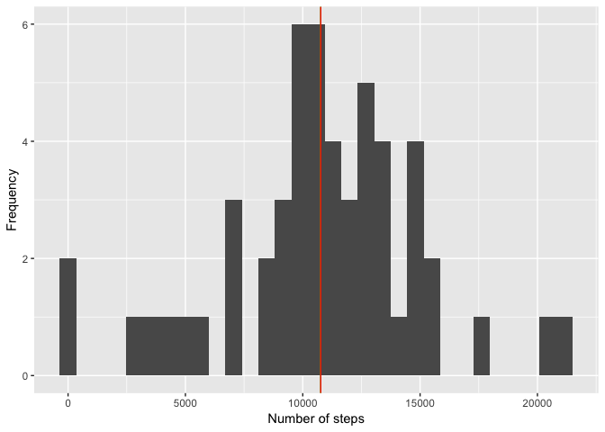
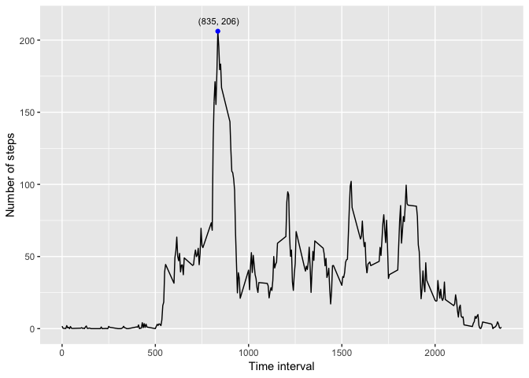

## Loading and preprocessing the data
First of all the script checks if there is a folder "data" in a working directory
and if there is a file "activity.csv" in that directory. If there is no such a file
the script will download and unzip it, if there is no such a directory - it will
create one.

```r
if (!file.exists("./data"))
    dir.create("./data")
if (!file.exists("./data/activity.csv"))
{
    fileURL <- "https://d396qusza40orc.cloudfront.net/repdata%2Fdata%2Factivity.zip"
    download.file(fileURL, "./data/data.zip",method = "curl")
    unzip("./data/data.zip", exdir = "./data")
}
```
Script reads the data to the data frame "data" and converts the column "date" from numeric
to Date type.

```r
data <- read.csv("./data/activity.csv")
data$date <- as.Date(as.character(data$date),"%Y-%m-%d")
```

## What is mean total number of steps taken per day?
To answer this question script aggregates data on day and then counts mean and
median number of steps.

```r
stepsByDay <- aggregate(steps~date,data=data,sum)
meanSteps <- mean(stepsByDay$steps)
medianSteps <- median(stepsByDay$steps)
```

So, meanSteps = 10766.19 and medianSteps = 10765 steps.  
After that script makes a histogram of the total number of steps taken each day.

```r
library(ggplot2)
range <- range(stepsByDay$steps)
bw <- (range[2] - range[1])/30
ggplot(stepsByDay,aes(steps)) + geom_histogram(binwidth = bw) + 
    geom_vline(xintercept = meanSteps,colour = "green") + 
    geom_vline(xintercept = medianSteps, colour = "red") + 
    xlab("Number of steps") + ylab("Frequency")
```

<!-- -->

Mean and median lines overlap.

## What is the average daily activity pattern?

To find it out the script makes time series plot of average number of steps taken.

```r
stepsByInterval <- aggregate(steps~interval,data=data,mean)
maxTimeInt <- which.max(stepsByInterval$steps)
maxTime <- stepsByInterval$interval[maxTimeInt]
maxSteps <- stepsByInterval$steps[maxTimeInt]
maxStepsR <- round(maxSteps)
pointLabel <- paste0("(", stepsByInterval$interval[maxTimeInt], ", ", maxStepsR,")")

ggplot(stepsByInterval,aes(x=interval,y=steps)) + geom_line() +
    annotate("point",x=maxTime, y=maxSteps,colour = "blue") +
    annotate("text",x=maxTime + 5 , y=maxSteps + 7 ,
             label = pointLabel, size = 3) +
    xlab("Time interval") + ylab("Number of steps")
```

<!-- -->

The plot shows also the point with maximum number of steps. Average maximum number
of steps is 206 on the interval 835.

## Imputing missing values

There are missing values in the data set.

```r
colSums(is.na(data))
```

```
##    steps     date interval 
##     2304        0        0
```
Script counts how many percents it is:

```r
round(100*mean(is.na(data$steps)))
```

```
## [1] 13
```
To fix it, the script imputes mean for that 5-minute interval instead of NA.

```r
dataImputed <- data
for (i in 1: nrow(dataImputed))
    if(is.na(dataImputed$steps[i]))
    {
        num <-which(stepsByInterval$interval == dataImputed$interval[i])
        dataImputed$steps[i] <- stepsByInterval$steps[num]
    }
```
Script counts mean and median again.

```r
stepsByDay2 <- aggregate(steps~date,data=dataImputed,sum)
range2 <- range(stepsByDay2$steps)
bw2 <- (range2[2] - range2[1])/30
meanSteps2 <- mean(stepsByDay2$steps)
medianSteps2 <- median(stepsByDay2$steps)
meanSteps2
```

```
## [1] 10766.19
```

```r
medianSteps2
```

```
## [1] 10766.19
```
And makes histogram of total number of steps on imputed data.

```r
ggplot(stepsByDay2,aes(steps)) + geom_histogram(binwidth = bw2) + 
    geom_vline(xintercept=meanSteps2,colour = "green") + 
    geom_vline(xintercept = medianSteps2, colour = "red") + 
    xlab("Number of steps") + ylab("Frequency")
```

<!-- -->

Median is still the same, mean have changed a little bit and now equals median.
Script compares histograms.

```r
stepsByDay$type <- "Original"
stepsByDay2$type <- "With imputed values"
stepsByDayBig <- rbind(stepsByDay,stepsByDay2)
ggplot(stepsByDayBig,aes(steps)) + geom_histogram(binwidth = bw) + 
    geom_vline(xintercept = meanSteps,colour = "red") + facet_grid(.~type) +
    xlab("Number of steps") + ylab("Frequency")
```

<!-- -->

## Are there differences in activity patterns between weekdays and weekends?

Scripts adds new factor variable "dayType" - weekday/ weekend to discover it.

```r
dataWeekDays <- weekdays(dataImputed$date)
dataWeekDays<-gsub("Monday","weekday",dataWeekDays)
dataWeekDays<-gsub("Tuesday","weekday",dataWeekDays)
dataWeekDays<-gsub("Wednesday","weekday",dataWeekDays)
dataWeekDays<-gsub("Thursday","weekday",dataWeekDays)
dataWeekDays<-gsub("Friday","weekday",dataWeekDays)
dataWeekDays<-gsub("Saturday","weekend",dataWeekDays)
dataWeekDays<-gsub("Sunday","weekend",dataWeekDays)
dataWeekDays <- as.factor(dataWeekDays)
dataImputed$dayType <- dataWeekDays

stepsByIntervalCompare <- aggregate(steps~interval+dayType,data=dataImputed,mean)
ggplot(stepsByIntervalCompare,aes(x=interval,y=steps)) + geom_line() +
    facet_wrap(dayType~.,nrow=2, strip.position="top") +
    xlab("Time interval") + ylab("Number of steps")
```

<!-- -->

So, there are now such a morning peak on weekends as on weekdays, but all weekend
day is a little bit more active.
